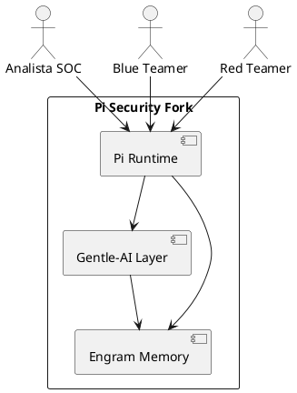
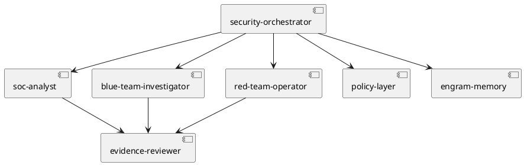

# UML de Contexto y Componentes

## Diagrama de contexto

```plantuml
@startuml
actor "Analista SOC" as SOCUser
actor "Blue Teamer" as BlueUser
actor "Red Teamer" as RedUser

rectangle "Pi Security Fork" {
  component "Pi Runtime" as Pi
  component "Gentle-AI Layer" as Gentle
  component "Engram Memory" as Engram
}

SOCUser --> Pi
BlueUser --> Pi
RedUser --> Pi
Pi --> Gentle
Pi --> Engram
Gentle --> Engram
@enduml
```

## Diagrama de componentes

```plantuml
@startuml
component "security-orchestrator" as O
component "soc-analyst" as S
component "blue-team-investigator" as B
component "red-team-operator" as R
component "evidence-reviewer" as E
component "policy-layer" as P
component "engram-memory" as M

O --> S
O --> B
O --> R
S --> E
B --> E
R --> E
O --> P
O --> M
@enduml
```

## Próximo paso
Convertir esta vista conceptual en estructura implementable del fork.
