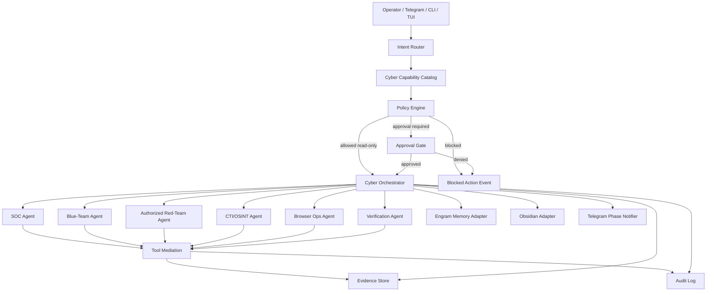
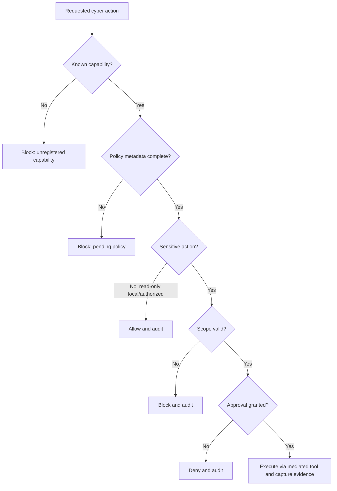
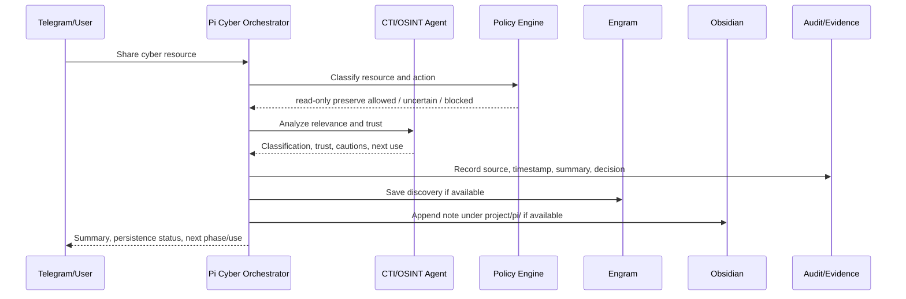
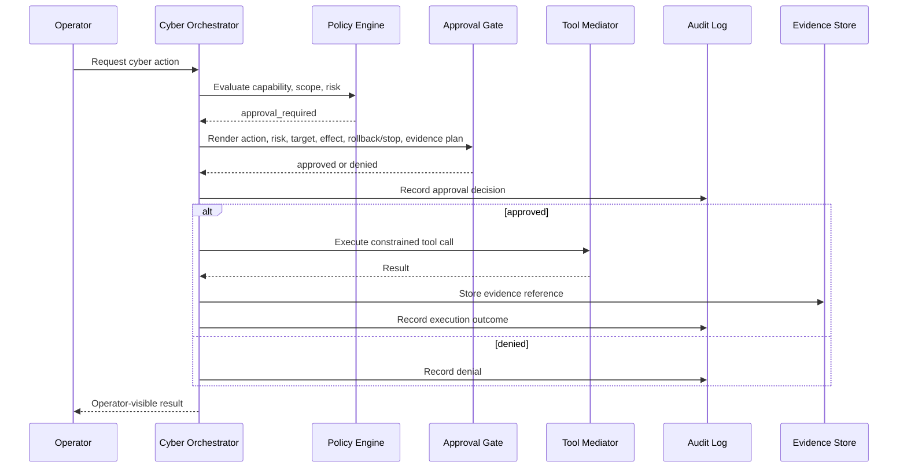
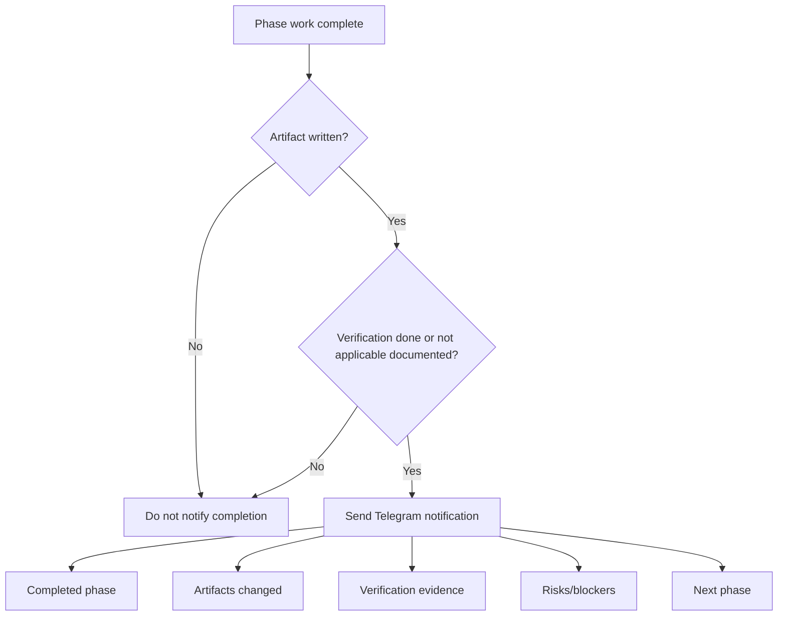

# Pi Cyber Harness Technical Design

## Status

`design` phase draft for `pi-cyber-harness`.

This design is documentation-only. It does not authorize source implementation, offensive automation, browser evasion, external scanning, or unrestricted tool execution. Implementation remains blocked until the task plan defines a first safe slice, review workload, official verification gates, and issue/PR workflow.

## Design goals

- Define a governed cyber harness architecture for Pi/Gentle AI.
- Keep `packages/coding-agent` as the primary future implementation center unless later design explicitly expands scope.
- Make SOC, Blue-Team, authorized Red-Team, CTI/OSINT, browser operations, guardrails, audit, evidence, memory, Obsidian, Telegram, and verification boundaries explicit.
- Default dual-use and externally targeted capabilities to disabled until policy and authorization are present.
- Preserve the user's strict phase workflow: branch per phase, documented artifacts, verification, issue on failures, Pull Request, push, merge to `main`, Telegram phase notice.

## Non-goals

- No source code changes in this phase.
- No active Red-Team execution.
- No fingerprint injection, CAPTCHA bypass, stealth browsing, credential abuse, persistence, exploitation, or third-party testing.
- No real provider APIs, paid tokens, API keys, or external target operations.
- No claim of E2E readiness until an official E2E gate exists and passes.

## Architecture overview

The Pi Cyber Harness should be implemented as a governed capability layer above the existing Pi coding-agent/session/tool runtime. The layer classifies cyber work, selects approved agents/skills, enforces policy, records audit/evidence, and routes persistence/notifications.



## Proposed module boundaries

Future implementation should start in `packages/coding-agent`, because this is where Pi already owns user-facing agent runtime behavior, session orchestration, prompts, tools, commands, extensions, and provider/auth validation.

| Module | Future home | Responsibility | Expansion risk |
| --- | --- | --- | --- |
| Cyber capability catalog | `packages/coding-agent` | Static or resource-loaded registry of cyber capabilities, categories, tools, approvals, evidence requirements, dual-use class, enabled state. | Low if docs/config only; medium if dynamic extension loading is added. |
| Cyber policy engine | `packages/coding-agent` first; possibly shared later in `packages/agent` | Deny-by-default decisions for cyber actions and capability execution. | Medium, can become core if generic tool gating needs reuse. |
| Approval gate renderer | `packages/coding-agent` plus TUI/Web later | Structured approval prompts with risk, scope, effect, rollback/stop condition. | Medium, UI surfaces may expand to `packages/tui`/`packages/web-ui`. |
| Cyber orchestrator | `packages/coding-agent` | Routes validated cyber workflows to bounded agents/skills and tool mediation. | Medium/high; must avoid permission creep. |
| Audit/evidence recorder | `packages/coding-agent` first | Writes workflow events and evidence references to session artifacts/logs; later may support persistent audit store. | Medium. |
| Engram persistence adapter | `packages/coding-agent` integration/resource layer | Save discoveries and phase summaries when memory tools are callable. | Low if optional. |
| Obsidian persistence adapter | Extension/resource tool integration | Save organized research under `project/pi/` when Obsidian tools are callable. | Low if optional. |
| Telegram notifier | Existing Telegram bridge/output path | Sends phase completion and next-phase messages. | Low/medium, transport availability must be detected. |
| Verification gate resolver | `packages/coding-agent` SDD workflow layer | Determines phase verification commands, documentation-only checks, and official E2E gate. | Medium. |

## Capability catalog model

Every cyber capability should be declarative. Execution should be impossible when policy-critical fields are missing.

Suggested shape:

```ts
interface CyberCapability {
  id: string;
  title: string;
  category:
    | "soc"
    | "blue-team"
    | "authorized-red-team"
    | "cti-osint"
    | "browser-ops"
    | "guardrail"
    | "audit"
    | "verification";
  status: "enabled" | "disabled" | "blocked-pending-policy";
  purpose: string;
  roleBoundary: string;
  allowedTools: string[];
  forbiddenBehaviors: string[];
  inputConstraints: string[];
  outputRequirements: string[];
  approval: ApprovalRequirement;
  evidence: EvidenceRequirement;
  auditEvents: CyberAuditEventType[];
  retention: RetentionPolicy;
  dualUse: DualUseClassification;
  defaultRisk: RiskLevel;
}
```

Policy-critical required fields:

- category
- status
- allowed tools
- forbidden behaviors
- approval requirement
- evidence requirement
- audit event set
- dual-use classification
- retention note

If any are absent, status MUST resolve to `blocked-pending-policy`.

## Agent and skill boundaries

### Parent cyber orchestrator

- Owns routing, policy evaluation, capability selection, approvals, audit, evidence links, and phase notifications.
- Does not allow child agents/skills to spawn further agents unless an explicit policy grants it.
- Enforces read-only defaults and denies sensitive actions before tool execution.

### SOC agent

Allowed:

- Alert triage.
- Enrichment from configured read-only sources.
- Evidence gathering.
- Runbook guidance.
- Incident report drafting.

Forbidden by default:

- Blocking IPs.
- Disabling users.
- Quarantining hosts.
- Modifying tickets or external systems without approval.

Output requirements:

- Facts, sources, timestamps, confidence, uncertainty, recommended next actions, evidence references.

### Blue-Team agent

Allowed:

- Detection engineering drafts.
- Log review.
- Hardening recommendations.
- Threat modeling.
- MITRE ATT&CK, NIST, STRIDE, and GRC mapping.

Forbidden by default:

- Claiming detection validity without test evidence.
- Modifying production controls without approval.

Output requirements:

- Detection objective, assumptions, query/rule body, expected true/false positives, test data requirements, control mappings, verification status.

### Authorized Red-Team agent

Allowed only with active authorization scope:

- Safe planning and scoping.
- Defensive validation inside approved targets, actions, time window, and stop conditions.
- Evidence capture and report drafting.

Forbidden always unless future explicit policy and legal approval says otherwise:

- Unscoped exploitation.
- Credential theft or abuse.
- Persistence.
- Stealth.
- Third-party testing.
- Anti-abuse evasion.
- Actions outside time window or target list.

Output requirements:

- Matching scope clause, action plan, risk, expected effect, approval record, stop condition, evidence references, result.

### CTI/OSINT agent

Allowed:

- Public/authorized source collection.
- Summarization, enrichment, cross-reference.
- Trust classification.
- Preservation into Engram and Obsidian when tools exist.

Forbidden by default:

- Bypassing access controls.
- Collecting sensitive personal data without explicit purpose and policy.
- Treating unverifiable sources as trusted.

Output requirements:

- Source, timestamp, access method, trust rationale, classification, confidence, license/terms note when known, dual-use cautions, next use.

### Browser Ops agent

Allowed:

- Reading public pages.
- Capturing screenshots or page evidence.
- Testing owned/local web apps.
- Authorized collection from scoped sources.

Sensitive actions requiring approval:

- Authenticated sessions.
- Form submissions.
- Downloads/uploads.
- External site interactions beyond read-only.
- Scraping at scale.
- Any action that could trigger third-party side effects.

Blocked by default:

- CAPTCHA bypass.
- Fingerprint injection.
- Header camouflage for evasion.
- Stealth browsing.
- Anti-bot bypass.

Output requirements:

- URL, timestamp, tool, actions taken, policy decision, extracted evidence, warnings about terms/login/rate limits, blocked actions if any.

### Verification agent

Allowed:

- Resolve and run approved verification gates.
- Confirm docs-only artifacts exist.
- Confirm no source files were intentionally changed in docs-only phases.
- Run code checks/tests only when authorized by project rules/user instruction.

Output requirements:

- Commands, exit status, relevant output, skipped checks with reason, failures, issue/next-fix recommendation.

## Policy model

Policy should be deny-by-default and action-centric. A capability being enabled does not mean every action inside it is allowed.



### Risk levels

- `low`: local documentation, read-only local analysis, no external side effect.
- `medium`: external read-only collection, sensitive logs, authenticated read-only access, unverified CTI.
- `high`: state-changing action, production impact, sensitive data, browser interaction with external systems.
- `critical`: dual-use active testing, Red-Team validation, anti-abuse evasion concepts, destructive or intrusive action.

### Action classifications

| Classification | Default | Approval | Notes |
| --- | --- | --- | --- |
| Local docs/research | Allow | Not required | Still audit if part of cyber workflow. |
| Read-only public CTI/OSINT | Allow with caution | Optional for normal scrape; required if browser-sensitive. | Track source and terms. |
| Read-only internal logs | Allow only if source configured | May require approval depending on sensitivity. | Preserve least privilege. |
| State-changing defensive action | Block until approval | Required | Include rollback. |
| Authorized Red-Team active action | Disabled until scope exists | Required per action | Scope, time, target, stop condition. |
| Browser anti-bot/fingerprint evasion | Block | Only future explicit legal/testing policy | Reference for risk modeling only. |
| Credential/persistence/stealth abuse | Block | Not allowed in this design | Do not implement unrestricted capability. |

### Authorization scope artifact

Authorized Red-Team workflows require a scope artifact:

```yaml
id: redteam-scope-<date>-<slug>
owner: <person/team>
approver: <person/team>
time_window:
  starts_at: <iso8601>
  ends_at: <iso8601>
targets:
  allowed:
    - <host/app/account/range>
  prohibited:
    - <host/app/account/range>
actions:
  allowed:
    - <action class>
  prohibited:
    - <action class>
stop_conditions:
  - <condition>
evidence_requirements:
  - <requirement>
reporting_requirements:
  - <requirement>
```

No active Red-Team tool action may run without matching target, action, and time window.

## Data flow

### CTI/OSINT preservation flow



### Sensitive action flow



## Audit and evidence model

Audit events should be structured and append-only within the selected storage mechanism. Initial implementation can use session artifacts/log files, but the schema should be stable enough to move to a persistent store later.

### Audit event shape

```ts
interface CyberAuditEvent {
  id: string;
  timestamp: string;
  workflowId: string;
  phase?: "proposal" | "spec" | "design" | "tasks" | "apply" | "verify" | "archive";
  capabilityId?: string;
  eventType:
    | "workflow.started"
    | "capability.selected"
    | "policy.decided"
    | "approval.requested"
    | "approval.decided"
    | "tool.executed"
    | "action.blocked"
    | "evidence.captured"
    | "verification.completed"
    | "phase.notified"
    | "workflow.completed";
  actor?: string;
  summary: string;
  risk: RiskLevel;
  decision: "allow" | "require_approval" | "deny" | "blocked" | "approved" | "skipped";
  policyRuleIds: string[];
  target?: string;
  actionHash?: string;
  evidenceRefs: string[];
  status: "pending" | "completed" | "failed" | "blocked" | "skipped";
}
```

### Evidence reference shape

```ts
interface CyberEvidenceRef {
  id: string;
  kind:
    | "source-url"
    | "screenshot"
    | "command-output"
    | "tool-result"
    | "file-artifact"
    | "memory-observation"
    | "obsidian-note"
    | "verification-output";
  uriOrPath: string;
  capturedAt: string;
  sourceName?: string;
  summary: string;
  rawAvailable: boolean;
  verificationStatus: "unverified" | "verified" | "disputed" | "not-applicable";
  confidence?: "low" | "medium" | "high";
  retention: string;
}
```

### Evidence principles

- Evidence must distinguish raw source, summary, and analyst/agent interpretation.
- Confidence must be explicit for findings.
- Unverified claims must remain labeled as assumptions.
- Tool invocations should record command/tool summary, not secrets.
- Secret values and credentials must be redacted from evidence.
- Blocked actions are evidence too and must be auditable.

## Engram and Obsidian persistence

Persistence is optional based on tool availability, but the workflow must never claim persistence happened unless the tool call succeeded.

### Engram

Use Engram for compact, searchable findings and decisions:

- Trusted cyber resource discoveries.
- Architecture/design decisions.
- Policy decisions.
- Bug fixes or verification discoveries.
- Phase summaries.

Suggested topic keys:

- `sdd/pi-cyber-harness/proposal`
- `sdd/pi-cyber-harness/spec`
- `sdd/pi-cyber-harness/design`
- `sdd/pi-cyber-harness/tasks`
- `sdd/pi-cyber-harness/verify`
- `cyber-harness/resources/<slug>`
- `cyber-harness/policy/<slug>`

### Obsidian

Use the user's vault under `project/pi/` for human-readable project continuity:

- `project/pi/Cybersecurity Agent Resources.md`
- `project/pi/Pi Cyber Harness Design.md`
- `project/pi/Pi Cyber Harness Decisions.md`
- `project/pi/Pi Cyber Harness Verification.md`

Each saved resource should include:

- What was found.
- Why it matters.
- Where it was found.
- Trust assessment.
- Classification: SOC, Blue-Team, Red-Team, CTI/OSINT, browser ops, guardrail, audit, verification.
- Dual-use cautions.
- Suggested use in Pi.

## Telegram notification flow

Phase notifications should be short, evidence-based, and sent only after phase artifact creation and phase-appropriate verification.



Suggested message shape:

```text
Fase terminada: <phase>
Artefactos: <paths>
Verificación: <command/check + result, or docs-only rationale>
Riesgos: <blockers or none>
Sigue: <next phase>
```

Do not use Telegram completion language if verification was skipped without rationale.

## Official E2E verification strategy

No dedicated root E2E script exists in the current project context. This design therefore defines a staged E2E strategy and an implementation blocker.

### Phase 0: documentation-only verification

For proposal/spec/design/tasks phases:

- Verify expected OpenSpec artifact exists.
- Verify phase did not intentionally modify source packages.
- Skip code tests with explicit docs-only rationale.
- Do not claim E2E readiness.

Recommended documentation-only command/check set:

```bash
test -f openspec/changes/pi-cyber-harness/proposal.md
test -f openspec/changes/pi-cyber-harness/specs/cyber-harness/spec.md
test -f openspec/changes/pi-cyber-harness/design.md
git diff --name-only -- packages/ packages/ai packages/agent packages/coding-agent packages/tui packages/web-ui
```

Expected: artifact files exist and source package diff is empty for docs-only phases.

### Phase 1: initial implementation gate

Before any code merge, tasks must define the affected package. For likely `packages/coding-agent` work:

- `npm run check` from repo root after code changes, because project rules require it.
- Targeted package tests from package root when test files are created or modified.
- For `packages/coding-agent/test/suite/`, use local harness and faux provider only.
- Do not run real providers, API keys, paid tokens, or external target tests.

### Phase 2: official E2E gate proposal

The first code task should add or document one official E2E gate. Options:

1. Add root script `test:e2e:cyber-harness` that runs a local, deterministic cyber harness scenario with mocked tools and faux provider.
2. Add a package script under `packages/coding-agent` and reference it from OpenSpec verification.
3. Define a composite gate using existing browser smoke plus cyber harness regression suite.

Recommended path: package-local deterministic E2E first, then root alias later.

Candidate future command:

```bash
cd packages/coding-agent
npx tsx ../../node_modules/vitest/dist/cli.js --run test/suite/regressions/pi-cyber-harness-policy.test.ts
```

This should test:

- Unknown cyber capability is disabled.
- Browser anti-bot/fingerprint action is blocked without authorization.
- Authorized Red-Team action without scope is blocked.
- Trusted CTI resource preservation emits Engram/Obsidian adapter calls when mocked available.
- Phase notification payload contains completed phase, artifact path, verification, blocker, and next phase.

The exact command remains a tasks/apply decision. Until implemented and passing, E2E status is `not_detected`/`blocked`.

## Threat model for dual-use capabilities

| Threat | Scenario | Impact | Control |
| --- | --- | --- | --- |
| Unscoped offensive automation | Operator or prompt asks for Red-Team action without authorization. | Legal/security harm. | Red-Team disabled by default, scope artifact required, approval per action, audit blocked attempts. |
| Browser evasion misuse | Request uses fingerprint injection, CAPTCHA bypass, or stealth automation. | Anti-abuse bypass, policy violation. | Block by default, allow only as risk-model reference unless explicit legal testing policy exists. |
| Prompt injection from web/CTI sources | External content tries to override agent rules or exfiltrate data. | Tool misuse, data leak. | Treat web content as untrusted, isolate summaries, policy engine mediates tools, no secret exposure. |
| Tool permission creep | New skill registers broad tools without policy. | Excessive capabilities. | Catalog requires policy metadata; missing policy disables capability. |
| False positive security findings | Agent reports unverified vulnerabilities or detections. | Bad operational decisions. | Confidence scoring, evidence refs, assumptions labels, verification requirement. |
| Sensitive data over-collection | OSINT/log workflows collect personal/private data unnecessarily. | Privacy/compliance risk. | Classify data source, minimize collection, retention notes, approval for sensitive data. |
| Unauthorized state changes | SOC/Blue-Team workflow modifies production controls. | Outage or customer impact. | Approval gate with target/effect/rollback; audit decision. |
| Incomplete audit trail | Actions happen without durable record. | No reviewability. | Audit events for workflow, policy, approval, tool, evidence, verification, notification. |
| Telegram overclaiming | User receives “done” without verification. | Broken trust and unsafe workflow. | Completion notification requires artifact + fresh verification or documented not-applicable rationale. |
| Memory persistence hallucination | Agent claims Engram/Obsidian saved when tools unavailable. | Lost context. | Adapter availability checks; explicit unavailable status; include structured fallback content. |

## Rollout plan

### Slice 1: documentation and policy skeleton

- Finalize proposal/spec/design/tasks artifacts.
- Define official E2E gate in tasks.
- No runtime source changes.

### Slice 2: capability catalog and policy evaluator

- Implement catalog data shape.
- Implement deny-by-default policy decisions.
- Add deterministic tests for missing policy, blocked dual-use, and read-only allow.

### Slice 3: audit/evidence schema

- Add structured audit event and evidence reference helpers.
- Add tests for sensitive action, approval decision, blocked action, and evidence capture.

### Slice 4: CTI/OSINT preservation adapters

- Add optional Engram/Obsidian adapter boundaries or integration with existing tool availability.
- Mock persistence in tests.

### Slice 5: Telegram phase notification

- Add structured phase notification payload creation.
- Keep transport adapter optional and test payloads without real Telegram.

### Slice 6: agent/skill catalog integration

- Register SOC, Blue-Team, authorized Red-Team, CTI/OSINT, Browser Ops, Guardrail, Audit, and Verification capability stubs.
- Keep dangerous capabilities disabled until explicit task/design extends them.

## File changes forecast

Documentation/design phases:

- `openspec/changes/pi-cyber-harness/proposal.md`
- `openspec/changes/pi-cyber-harness/specs/cyber-harness/spec.md`
- `openspec/changes/pi-cyber-harness/design.md`
- `openspec/changes/pi-cyber-harness/tasks.md`
- `openspec/changes/pi-cyber-harness/verify.md`
- `openspec/changes/pi-cyber-harness/archive.md`

Likely future implementation files, subject to tasks approval:

- `packages/coding-agent/src/core/cyber-harness/*`
- `packages/coding-agent/src/core/cyber-harness/catalog.ts`
- `packages/coding-agent/src/core/cyber-harness/policy.ts`
- `packages/coding-agent/src/core/cyber-harness/audit.ts`
- `packages/coding-agent/src/core/cyber-harness/evidence.ts`
- `packages/coding-agent/src/core/cyber-harness/notifications.ts`
- `packages/coding-agent/test/suite/regressions/pi-cyber-harness-*.test.ts`

Potential later UI surfaces:

- `packages/tui` for approval rendering.
- `packages/web-ui` for catalog/audit dashboards.

## Design decisions

1. `packages/coding-agent` is the first implementation center.
   - Reason: it owns the coding/runtime harness surface most relevant to skills, session policy, commands, tools, and user workflows.

2. Capability registration is declarative and deny-by-default.
   - Reason: missing policy is safer as disabled than implicitly allowed.

3. Red-Team and browser evasion capabilities are disabled by default.
   - Reason: dual-use risk is high and authorization must be explicit.

4. Audit/evidence are first-class outputs, not afterthought logs.
   - Reason: SOC/Blue-Team/Red-Team work must be reviewable and reproducible.

5. Engram and Obsidian are optional adapters with explicit availability checks.
   - Reason: persistence tools may not be present in every execution environment.

6. E2E remains blocked until a deterministic local gate is implemented or documented.
   - Reason: no current root E2E script exists.

## Verification for this design phase

This design phase is documentation-only. Appropriate verification is:

- Confirm the design artifact exists at the expected path.
- Confirm no source code was intentionally modified by this phase.
- Do not run code tests for this phase.
- Do not claim E2E readiness.

If copied into the repository, the expected repository path should be:

`openspec/changes/pi-cyber-harness/design.md`

## Next phase

Proceed to `tasks` for `pi-cyber-harness`.

The task plan must:

- Convert this design into small reviewable steps.
- Define exact files for the first safe slice.
- Define the official E2E gate or a concrete task to create it.
- Include test-first steps for any code changes.
- Include review workload estimate and PR strategy.
- Preserve branch/PR/issue/Telegram workflow requirements.

## Skill resolution

`injected`
